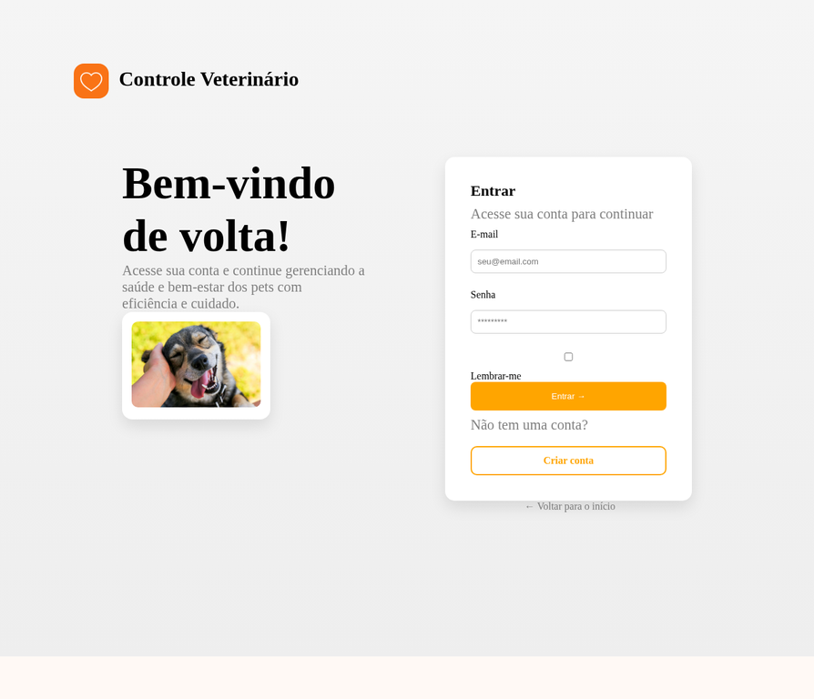
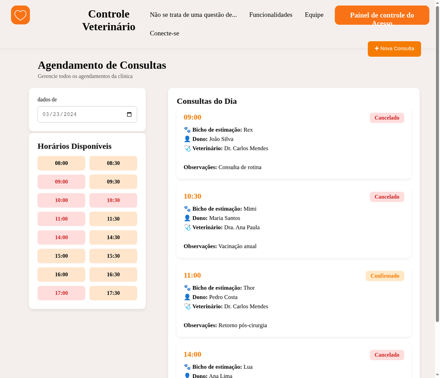

# 🐾 Controle Veterinário

<p align="center">
  
  
  
</p>

<p align="center">
  <strong>🚀 Sistema inteligente para gestão de clínicas veterinárias</strong><br>
  Desenvolvido para modernizar agendamentos, atendimentos e processos administrativos.
</p>

---

# 📌 Visão Geral

O **Controle Veterinário** é uma plataforma web criada para facilitar a rotina de clínicas veterinárias, oferecendo organização, agilidade e praticidade no gerenciamento diário.

O sistema centraliza informações importantes como consultas, horários disponíveis, dados de clientes e pets, tornando o atendimento mais eficiente.

---

# ✨ Principais Funcionalidades

✅ Sistema de Login e Cadastro  
✅ Painel Administrativo  
✅ Agendamento de Consultas  
✅ Controle de Horários  
✅ Status de Consultas  
✅ Interface Responsiva  
✅ Navegação Moderna  
✅ Gestão de Clientes e Pets  

---

# 📸 Demonstração do Sistema

## 🏠 Página Inicial

<p align="center">
  
</p>

---

## 🔐 Tela de Login

<p align="center">
  
</p>

---

## 📅 Painel de Consultas

<p align="center">
  
</p>

---

# 🛠️ Tecnologias Utilizadas

<p align="center">


</p>

---

# 🎯 Objetivo do Projeto

Criar uma solução digital moderna para clínicas veterinárias, melhorando processos internos, organização de consultas e experiência de atendimento ao cliente.

---

# 👨‍💻 Equipe Oficial

| Integrante | Função | GitHub |
|-----------|--------|--------|
| Clara Santana | Back-end | Adicionar GitHub |
| Gustavo Henrique | Back-end | https://github.com/Gusttavoenrike |
| Vinícius Santos | Front-end / Banco de Dados | https://github.com/ViniSantosC |
| Victor Correa | Front-end / Banco de Dados | Adicionar GitHub |

---

# 📊 Estrutura do Sistema

```bash
Projeto-1/
│── backend/
│── front-end/
│── database/
│── assets/
│── README.md
